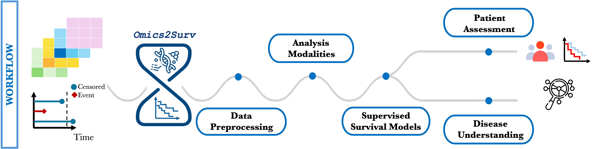

# 


Omics2Surv

Integrative survival analysis for multi-omics data

**Omics2Surv** is an R package for **survival analysis with
high-dimensional multi-omics data**.

It provides a unified and extensible framework to **fit, integrate, and
compare survival models**

across different omics layers under multiple integration paradigms.

## 📦 Package overview

**Omics2Surv** key features:

📥 Support for heterogeneous multi-omics data

🔗 Multiple data integration strategies:

``` R
Single-omics modeling

Early integration

Late integration

Joint integration
```

🍔 Standardized data handling via `MultiAssayExperiment`

📊 Unified performance evaluation

🔁 Fair and reproducible model comparison

📉 Classical, machine learning, and deep learning survival models

## 🔀 Analysis workflow



**Omics2Surv** follows a modular workflow: 1. Multi-omics input data 2.
Harmonization and preprocessing 3. Integration strategy selection 4.
Survival model fitting 5. Performance evaluation 6. Patient Assessment
7. Visualization

## 📉 Supported modeling strategies

### Single-omics, early and late integration

- **Cox LASSO / Elastic Net / Adaptive LASSO**  
  Penalized Cox models for high-dimensional omics data.

- **Penalized AFT models**  
  Accelerated Failure Time models with regularization.

### Joint integration models

- **CoopCox / AFTCoop**  
  Cooperative regression models that encourage agreement across omics
  layers.

- **blockForest**  
  Random Forests adapted for grouped multi-omics predictors.

- **flexynesis**  
  Deep learning–based survival models implemented via Python backend.

| Method                  | Reference                                                                           |
|-------------------------|-------------------------------------------------------------------------------------|
| Cox LASSO / Elastic Net | [Noah Simon et al. (2011)](https://doi.org/10.18637/jss.v039.i05)                   |
| Cox Adaptive LASSO      | [Hao Helen Zhang , Wenbin Lu (2007)](https://doi.org/10.1093/biomet/asm037)         |
| Penalized AFT           | [Piotr M. Suder, Aaron J. Molstad (2022)](https://doi.org/10.1002/sim.9264)         |
| CoopCox                 | [Georg Hahn et al. (2024)](https://doi.org/10.1093/bib/bbae267)                     |
| AFTCoop                 | Angelini et al. (2025)                                                              |
| blockForest             | [Roman Hornung, Marvin N. Wright (2019)](https://doi.org/10.1186/s12859-019-2942-y) |
| flexynesis              | [Bora Uyar et al. (2025)](https://doi.org/10.1038/s41467-025-63688-5)               |

## ⚙️ Installation

You can install **Omics2Surv** from GitHub:

``` r
# install.packages("devtools")
devtools::install_github("FraCalanca/Omics2Surv")
```

## 📚 Documentation

Function reference are available on the package website

## 🏛 Funding

This work is supported by the PRIN 2022 PNRR P2022BLN38
project, Computational approaches for the integration of multi-omics
data funded by European Union - Next Generation EU, CUP B53D23027810001.
